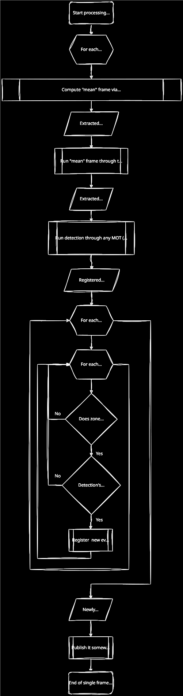
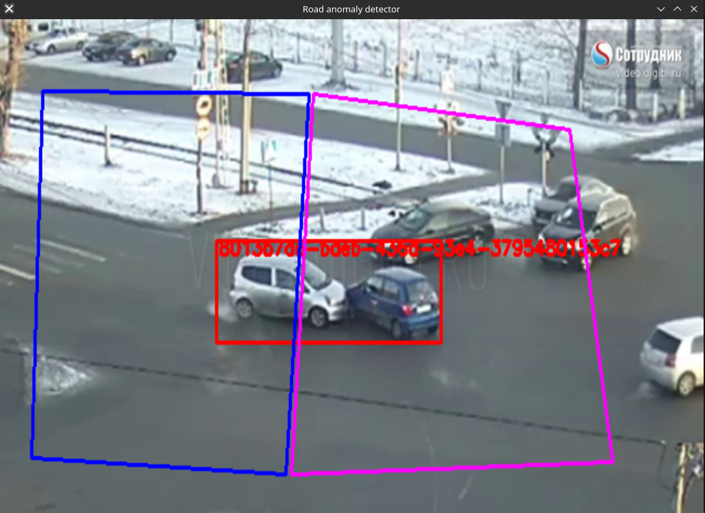
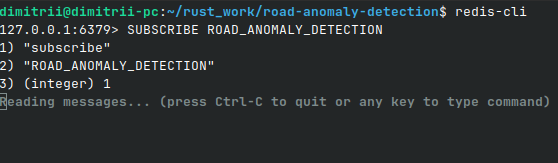
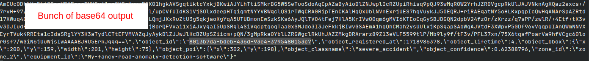

# Yet another toy utility for registering anomaly situations on roads

In W.I.P. stage

## Table of Contents

- [About](#about)
- [How does it work?](#how-does-it-work)
- [MOG2](#mog2)
- [Screenshots](#screenshots)
- [Installation and usage](#installation-and-usage)
- [Configuration](#configuration)
- [Published events](#published-events)
- [Future works](#future-works)
- [References](#references)
- [Support](#support)

## About

This project is aimed to register road traffic accidents, foreign object and other anomaly situations on roads. It is pretty simple and uses just YOLO (both [traditional](https://github.com/AlexeyAB/darknet) and [Ultralytics version](https://github.com/ultralytics/ultralytics) could be used). Some advanced techniques like 3D-CNN, LSTM's and others could be used, but I do not have that much time so PR's are very welcome.

OpenCV is not required. Inference uses ONNX Runtime through `od_opencv` with its OpenCV features disabled. CPU and CUDA builds are available. Traditional Darknet models need to be converted to ONNX with YOLOv8 output layout before use. Video capture uses FFmpeg or GStreamer, MOG2 and drawing are implemented in Rust, and the optional preview window uses [`minifb`](https://docs.rs/minifb/latest/minifb/).

I do have also utility for monitoring road traffic flow parameters [here](https://github.com/LdDl/rust-road-traffic)

## How does it work?

1. Capture BGR24 frames from a video file, RTSP stream, local camera or GStreamer pipeline.
2. Resize each frame to the configured network dimensions and update the MOG2 background model.
3. Run YOLO on the reconstructed background image.
4. Scale detections back to the original frame coordinates and track objects with `mot-rs`.
5. Register an event when an object's center is inside a configured zone and its lifetime exceeds the minimum threshold.
6. Publish the event to Redis as JSON with a PNG snapshot of the original frame encoded as Base64. Draw zones and tracked objects in the optional preview window.

An object that remains in the scene can become part of the MOG2 background and then be detected by YOLO. The foreground mask is also available from MOG2; inference uses the reconstructed background.

Diagram could speak more than a thousand words.



Diagram is prepared via https://app.diagrams.net/. Source is [here](docs/anomaly_detection.drawio).

## MOG2

I'm not digging into the Background Subtraction / Object Detection or MOT (Multi-object tracking) topic that much since it is not a main target of this project. But here is some information about MOG2 implementation in this project.

The implementation is in [src/background/background.rs](src/background/background.rs). Each pixel has up to five Gaussian components with independently updated weights, means and variances. Weak components are removed, and new components are added when a pixel does not match the current model. The background is reconstructed as a weighted mean of the strongest components.

Pixels are processed in parallel with [`rayon`](https://docs.rs/rayon/latest/rayon/). Model, mask and background buffers are reused between frames, and the pixel update does not allocate memory. MOG2 runs on the CPU in both builds; `ort-cuda` enables CUDA for neural network inference only.

The current parameters are set in code:

| Parameter | Value |
| --- | --- |
| Input size | `detection.net_width` by `detection.net_height` |
| History | `floor(FPS)` frames, approximately one second; 500 frames if this rounds to zero |
| Learning rate | `1 / min(2 * frames_processed, history)` |
| Maximum components per pixel | 5 |
| Foreground variance threshold | 16 |
| Component match threshold | 9 |
| Background weight threshold | 0.9 |
| Initial variance | 15, constrained to 4 through 75 during updates |
| Complexity reduction threshold | 0.05 |
| Shadow detection | Disabled |

The model update and defaults follow the [MOG2 reference implementation](https://github.com/opencv/opencv/blob/4.x/modules/video/src/bgfg_gaussmix2.cpp). This implementation handles BGR24 frames without shadow detection. Numerical equivalence and performance against the original version have not been measured.

## Screenshots

These screenshots were captured with the original version. The current preview uses `minifb` and Rust drawing primitives, so its appearance could differ.

Preview window:



Subscribe Valkey/Redis channel on the server:



Wait until event has come:



## Installation and usage

### Requirements

- Rust 1.91 or newer, as required by `od_opencv 0.8.2`.
- `ffmpeg` and `ffprobe` on `PATH` for video files, RTSP streams and V4L2 cameras. FFmpeg must support `-fps_mode passthrough`.
- `gst-launch-1.0` and the source-specific plugins for GStreamer pipelines, including CSI cameras.
- A desktop session for the optional `minifb` preview. Set `output.enable = false` for headless operation.
- A trained ONNX model and a video source. The model and example video referenced by [data/conf.toml](data/conf.toml) are not included in the repository.
- A Valkey/Redis server when event publishing is configured.
- For CUDA inference, an NVIDIA GPU with a driver and CUDA/cuDNN libraries compatible with the ONNX Runtime used by `ort = 2.0.0-rc.12`.

The capture implementation targets Linux. The original version was tested on Ubuntu 22.04.3 LTS. CPU and CUDA configurations have passed `cargo check` after removing OpenCV; runtime behavior and MOG2 performance still need validation.

### Build

Run the following commands from the project directory. CPU inference is the default:

```shell
cargo build --release --locked
```

To select the CPU backend explicitly:

```shell
cargo build --release --locked --no-default-features --features ort-backend
```

For CUDA inference:

```shell
cargo build --release --locked --features ort-cuda
```

The feature names are `ort-backend` and `ort-cuda`; `ort-cuda` also enables `ort-backend`. Both builds produce `target/release/road-anomaly-detector` and exclude OpenCV. The `ort` crate is pinned to `2.0.0-rc.12` because `od_opencv 0.8.2` uses that release's CUDA API.

### Model

Use an ONNX model with input named `images`, output named `output0`, and output layout `[1, 4 + number_of_classes, number_of_predictions]`, as used by YOLOv8/v9/v11. Set `net_width` and `net_height` to the model's input dimensions, and list `net_classes` in the same order as the model's classes.

Traditional Darknet YOLOv3/v4/v7 models must be converted to ONNX using `--format yolov8`; follow the [darknet2onnx conversion instructions](https://github.com/LdDl/darknet2onnx). `.cfg` and `.weights` files cannot be loaded directly by this application.

The example configuration uses two classes: "moderate_accident" and "severe_accident". Supply a model trained on these classes or update the class list for your model.

### Run

Edit [data/conf.toml](data/conf.toml) with the model path, video source, zones and publishing settings, then pass the configuration path as the only argument:

```shell
./target/release/road-anomaly-detector ./data/conf.toml
```

Without arguments, the application uses `./data/conf.toml`. Relative configuration, model and video paths are resolved from the current working directory.

Close the preview or press Escape or S to stop. Ctrl+C also stops capture in headless mode.

## Configuration

The complete example is in [data/conf.toml](data/conf.toml).

### Video input

| Source | `input.typ` | Example `input.video_src` |
| --- | --- | --- |
| Video file | `"rtsp"` | `"./data/tests/cctv_example.mp4"` |
| RTSP stream | `"rtsp"` | `"rtsp://camera.example/stream"` |
| V4L2 camera | `"device"` | `"0"` or `"/dev/video0"` |
| GStreamer pipeline | `"rtsp"` | Pipeline string ending with `appsink` |

The legacy `"rtsp"` value also selects file and GStreamer inputs. For GStreamer, separate pipeline elements with ` ! ` and specify `width=(int)`, `height=(int)` and `framerate=(fraction)` caps. The capture code replaces the sink and converts output to BGR24. A CSI camera pipeline is included as a commented example in the configuration file.

### Detection, tracking and zones

- `detection.network_weights`: path to the ONNX model. `network_format` defaults to `"onnx"`.
- `detection.network_ver`: optional legacy field accepting 3, 4, 7, 8, 9 or 11. It does not change the required ONNX output layout. `network_cfg` is unused.
- `detection.conf_threshold` and `nms_threshold`: detection confidence and overlap thresholds.
- `detection.target_classes`: labels to keep after detection. Omit it or use an empty array to keep all configured classes.
- `tracking.lifetime_seconds_min`: an object must live longer than this threshold before a zone can report it. Lifetime is measured using wall-clock timestamps during processing.
- `tracking.lifetime_seconds_max`: once an already reported object exceeds this age, its timing metadata is reset so it can be reported again after reaching the minimum lifetime. This value must exceed `lifetime_seconds_min`.
- `tracking.delay_seconds`: retained in the configuration but currently unused by the tracker. The tracker's missed-match limit is initialized from `floor(FPS)`.
- `zones`: quadrilaterals specified by four points in original frame coordinates, with optional RGB colors. The object's center must be strictly inside a zone; its boundary is excluded. Omit `zones` entirely for the default `"whole_image"` zone, inset five pixels from the frame edges. An explicit top-level `zones = []` disables zone event generation.

### Valkey/Redis publishing

Configure `publishers.redis` with `enable`, `host`, `port`, `username`, `password`, `db_index` and `channel_name`. The current code initializes a publisher whenever this section exists; its `enable` field is parsed but not checked. Omit the Redis section to disable publishing.

`channel_name` is required. An empty string selects `"ROAD_ANOMALIES_EVENTS"`; the example configuration explicitly uses `"ROAD_ANOMALY_DETECTION"`.

To observe events with the example settings, subscribe in another terminal before starting the detector:

```shell
redis-cli -h localhost -p 6379 SUBSCRIBE ROAD_ANOMALY_DETECTION
```

## Published events

Each message is a JSON object. The image value below is a placeholder for the Base64-encoded PNG:

```json
{
    "id": "1ff84f2d-7da4-43ad-a831-546dd65b4801",
    "event_registered_at": 1718971204,
    "event_image": "<base64-encoded PNG>",
    "object_id": "fa9dbcea-72cb-4a21-b1c0-265e5d0d319d",
    "object_registered_at": 1718971200,
    "object_lifetime": 4,
    "object_bbox": {
        "x": 80,
        "y": 110,
        "width": 120,
        "height": 60
    },
    "object_poi": {
        "x": 140,
        "y": 140
    },
    "object_classname": "moderate_accident",
    "object_confidence": 0.93,
    "zone_id": "zone_1",
    "equipment_id": "My-fancy-road-anomaly-detection-software"
}
```

Field descriptions:

| Field | Description |
| --- | --- |
| `id` | Unique UUID generated for this event. |
| `event_registered_at` | Time when the event was created, in Unix seconds (UTC). |
| `event_image` | Original frame before preview overlays, encoded as a PNG and then Base64. `null` if no snapshot is supplied. |
| `object_id` | UUID assigned to the object by the tracker. Multiple events can refer to the same object. |
| `object_registered_at` | Time when the object's current registration in the tracker started, in Unix seconds (UTC). |
| `object_lifetime` | Whole seconds between the object's registration and its latest matched detection. |
| `object_bbox` | Bounding rectangle around the object. `x` and `y` specify its top-left corner; `width` and `height` specify its size in pixels. |
| `object_poi` | Point of interest: the object's center, with pixel coordinates `x` and `y`. Used to check whether the object is inside a zone. |
| `object_classname` | Detected class name from `detection.net_classes`, such as "moderate_accident", recorded when the object is registered. |
| `object_confidence` | YOLO confidence score (0 to 1) recorded when the object is registered. |
| `zone_id` | Identifier of the zone where the event was registered, from `zones.id`. The automatically created zone uses "whole_image". |
| `equipment_id` | Application or equipment identifier from `application_info.id`. |

Bounding boxes and center points use original frame pixel coordinates, with the origin at the top-left corner, `x` increasing to the right and `y` increasing downward. Timestamps and lifetime use the system clock during processing. When an object is registered again after `tracking.lifetime_seconds_max`, its registration time and lifetime restart.

## Future works

* Make REST API to extract and to mutate configuration;
* Make MJPEG export;
* Make publishing to custom REST API via POST request;
* Prepare some pre-trained neural networks;

## References

* MOG2 - https://docs.opencv.org/4.x/d1/dc5/tutorial_background_subtraction.html
* MOT (Multi-object tracking) in Rust programming language - https://github.com/LdDl/mot-rs
* ONNX Runtime backend - https://docs.rs/od_opencv/0.8.2/od_opencv/
* Object detection in Rust programming language via YOLO - https://github.com/LdDl/object-detection-opencv-rust
* YOLO v3 paper - https://arxiv.org/abs/1804.02767, Joseph Redmon, Ali Farhadi
* YOLO v4 paper - https://arxiv.org/abs/2004.10934, Alexey Bochkovskiy, Chien-Yao Wang, Hong-Yuan Mark Liao
* YOLO v7 paper - https://arxiv.org/abs/2207.02696, Chien-Yao Wang, Alexey Bochkovskiy, Hong-Yuan Mark Liao
* Original Darknet YOLO repository - https://github.com/pjreddie/darknet
* Most popular fork of Darknet YOLO - https://github.com/AlexeyAB/darknet
* Developers of YOLOv8 - https://github.com/ultralytics/ultralytics. If you are aware of some original papers for YOLOv8 architecture, please contact me to mention it in this README.

Video example has been taken from [here](https://www.youtube.com/watch?v=z60Y20kJSmc)

Please cite this repository if you are using it

## Support

If you have troubles or questions please [open an issue](https://github.com/LdDl/road-anomaly-detection/issues/new).
